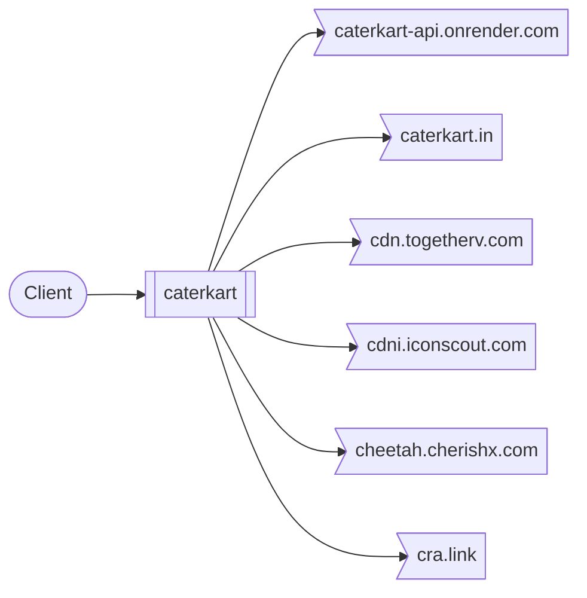
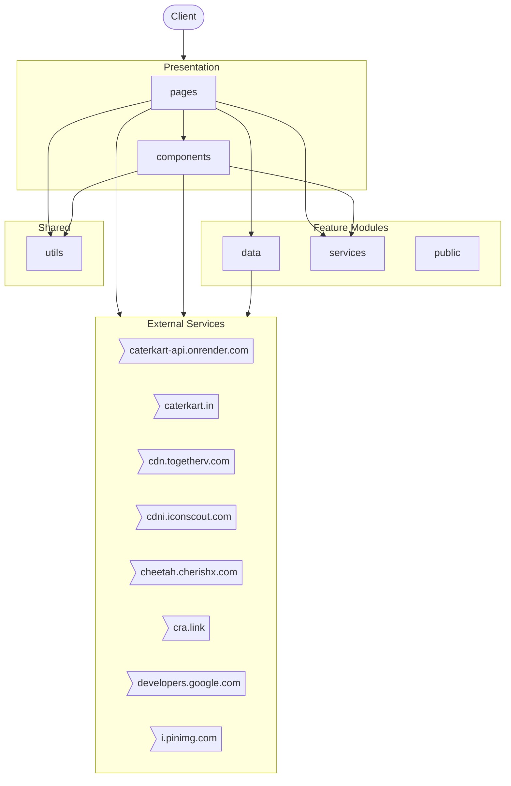
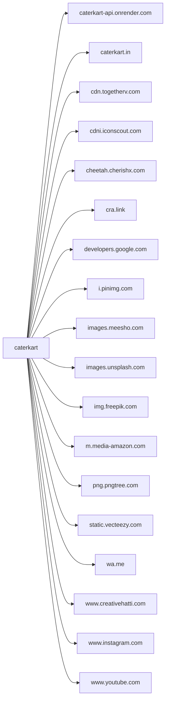

# caterkart

*Auto-generated by [zinsight](https://github.com/zinboard/zinsight) on 2026-05-24*

## What This App Does

**Caterkart** is a **frontend application** built with **React, React DOM**.

### Core Capabilities

- **Celebrations**
- **Celebrations Meals**
- **Create Menu**
- **Checkout**
- **Admin Regions**
- **Orders**
- **Order Details**
- **Food Inventory Orders**

In total, the system exposes **7** modules.

**Connects to:** **Google** APIs

## Overview

| **68** files · **10,548** lines of code · **7** modules |
|---|

**Project docs:** [Getting Started with Create React App](README.md)

## At a Glance

A 60-second mental snapshot — what calls in, what we call out, where state lives.



## Frontend at a Glance

**Framework:** React · **Router:** `react-router` · **Components:** 20 · **Pages:** 28 · **Styling:** Emotion

### Routes

| Path | Component | File |
|------|-----------|------|
| `/` | `Celebrations` | `src/App.js` |
| `/add-meal` | `CelebrationsMeals` | `src/App.js` |
| `/create-menu` | `CreateMenu` | `src/App.js` |
| `/checkout` | `Checkout` | `src/App.js` |
| `/admin` | `AdminRegionsPage` | `src/App.js` |
| `/admin/orders` | `OrdersPage` | `src/App.js` |
| `/admin/orders/:orderId` | `OrderDetailsPage` | `src/App.js` |
| `/admin/inventory/food` | `FoodInventoryOrders` | `src/App.js` |
| `/admin/inventory/decorations` | `DecorationsInventory` | `src/App.js` |
| `/admin/inventory/artists` | `ArtistsInventory` | `src/App.js` |
| `/admin/inventory/livestations` | `LiveStationsInventory` | `src/App.js` |
| `*` | `Celebrations` | `src/App.js` |

## Where State Lives

Every persistence and caching surface in the system.

- **Environment variables** — 2 environment variables drive runtime behaviour.

## External Contracts

Every connection to a system outside this repo — what we send, what we receive, how we authenticate.

| Service | Direction | We call | They call us | Auth |
|---------|-----------|---------|--------------|------|
| **caterkart-api.onrender.com** | outbound | `HTTPS · caterkart-api.onrender.com` | — | Unknown |
| **caterkart.in** | outbound | `HTTPS · caterkart.in` | — | Unknown |
| **cdn.togetherv.com** | outbound | `HTTPS · cdn.togetherv.com` | — | Unknown |
| **cdni.iconscout.com** | outbound | `HTTPS · cdni.iconscout.com` | — | Unknown |
| **cheetah.cherishx.com** | outbound | `HTTPS · cheetah.cherishx.com` | — | Unknown |
| **cra.link** | outbound | `HTTPS · cra.link` | — | Unknown |
| **developers.google.com** | outbound | `HTTPS · developers.google.com` | — | Unknown |
| **i.pinimg.com** | outbound | `HTTPS · i.pinimg.com` | — | Unknown |
| **images.meesho.com** | outbound | `HTTPS · images.meesho.com` | — | Unknown |
| **images.unsplash.com** | outbound | `HTTPS · images.unsplash.com` | — | Unknown |
| **img.freepik.com** | outbound | `HTTPS · img.freepik.com` | — | Unknown |
| **m.media-amazon.com** | outbound | `HTTPS · m.media-amazon.com` | — | Unknown |
| **png.pngtree.com** | outbound | `HTTPS · png.pngtree.com` | — | Unknown |
| **static.vecteezy.com** | outbound | `HTTPS · static.vecteezy.com` | — | Unknown |
| **wa.me** | outbound | `HTTPS · wa.me` | — | Unknown |
| **www.creativehatti.com** | outbound | `HTTPS · www.creativehatti.com` | — | Unknown |
| **www.instagram.com** | outbound | `HTTPS · www.instagram.com` | — | Unknown |
| **www.youtube.com** | outbound | `HTTPS · www.youtube.com` | — | Unknown |

## Where to Look

Common questions answered up front. If you want to change something, this tells you which files to open.

| If you want to change... | Look in |
|--------------------------|---------|
| **Configuration / Environment** — _Where env vars are read and the server bootstraps._ | `src/service-worker.js`, `src/serviceWorkerRegistration.js` |
| **Logging** — _Structured logs and log destinations._ | `src/pages/celebrations/components/ServicesAccordion/index.jsx`, `src/serviceWorkerRegistration.js` |
| **Background jobs / Queues** — _Async work, cron, queue consumers._ | `public/worker.js`, `src/service-worker.js`, `src/serviceWorkerRegistration.js` |

## What This Repo Isn't

Stops you looking for things that don't exist here.

- **No background job queue** — _No bull/kafka/rabbitmq/sqs imports detected._
- **No file uploads** — _No multer/busboy/formidable/FileInterceptor usage detected._
- **No payment processing** — _No payment-provider integration detected._
- **Single-region deployment (no multi-region replication detected)** — _No explicit multi-region configuration found._

## Table of Contents

- [What This App Does](#what-this-app-does)
- [Overview](#overview)
- [At a Glance](#at-a-glance)
- [Frontend at a Glance](#frontend-at-a-glance)
- [Where State Lives](#where-state-lives)
- [External Contracts](#external-contracts)
- [Where to Look](#where-to-look)
- [What This Repo Isn't](#what-this-repo-isnt)
- [Tech Stack](#tech-stack)
- [Architecture](#architecture)
- [Modules](#modules)
- [External Integrations](#external-integrations)
- [Environment Variables](#environment-variables)
- [Getting Started](#getting-started)
- [Testing](#testing)
- [New Developer Guide](#new-developer-guide)

## Tech Stack

| Category | Technologies |
|----------|-------------|
| **Runtime** | Node.js |
| **Languages** | JavaScript |
| **Frameworks** | React, React DOM |
| **HTTP Clients** | Axios |
| **Testing** | Jest DOM, React Testing Library |

## Architecture



## Modules

| Module | Purpose | Files | Lines |
|--------|---------|-------|-------|
| **pages** | Feature module — 28 files, 11 public exports. | 28 | 7,217 |
| **components** | Feature module — 21 files, 10 public exports. | 21 | 1,598 |
| **data** | Feature module — 6 files, 1 public export. | 6 | 1,191 |
| **services** | Feature module — 5 files, 4 public exports. | 5 | 100 |
| **public** | Feature module — 1 file, 0 public exports. | 1 | 47 |
| **utils** | Shared helpers and cross-cutting utilities. | 1 | 93 |

## External Integrations



| Service | Type | Methods | Files |
|---------|------|---------|-------|
| **caterkart-api.onrender.com** | api | — | 1 file(s) |
| **caterkart.in** | api | — | 1 file(s) |
| **cdn.togetherv.com** | api | — | 1 file(s) |
| **cdni.iconscout.com** | api | — | 2 file(s) |
| **cheetah.cherishx.com** | api | — | 2 file(s) |
| **cra.link** | api | — | 2 file(s) |
| **developers.google.com** | api | — | 1 file(s) |
| **i.pinimg.com** | api | — | 2 file(s) |
| **images.meesho.com** | api | — | 1 file(s) |
| **images.unsplash.com** | api | — | 2 file(s) |
| **img.freepik.com** | api | — | 4 file(s) |
| **m.media-amazon.com** | api | — | 1 file(s) |
| **png.pngtree.com** | api | — | 3 file(s) |
| **static.vecteezy.com** | api | — | 4 file(s) |
| **wa.me** | api | — | 1 file(s) |
| **www.creativehatti.com** | api | — | 1 file(s) |
| **www.instagram.com** | api | — | 1 file(s) |
| **www.youtube.com** | api | — | 1 file(s) |

## Environment Variables

### Required vs Optional

**2 required** (no fallback) · **0 optional** (default present in code).

| Required Variable | Risk if missing |
|-------------------|-----------------|
| `NODE_ENV` | Unknown — depends on what this variable controls. |
| `PUBLIC_URL` | Unknown — depends on what this variable controls. |

**Server**

| Variable | Used in |
|----------|---------|
| `PUBLIC_URL` | `src/service-worker.js`, `src/serviceWorkerRegistration.js` |

**Environment**

| Variable | Used in |
|----------|---------|
| `NODE_ENV` | `src/serviceWorkerRegistration.js` |

## Getting Started

### Prerequisites

- **Node.js** (check `.nvmrc` or `engines` in package.json for version)
- **npm** as package manager

### Installation

```bash
# Clone the repository
git clone <repository-url>
cd <project-directory>

# Install dependencies
npm install

# Set up environment variables
cp .env.example .env  # then fill in your values
```

### Running Locally

```bash
# Start production server
npm start

# Build for production
npm run build

```

## Testing

**Framework:** Jest DOM, React Testing Library

```bash
# Run tests
npm test
```

## New Developer Guide

> Everything you need to get oriented in this codebase as a new team member.

### Project Structure

```
├── src/                    # Application source root (6 files, 302 loc)
│   ├── pages/              # Business logic / services (28 files, 7,217 loc)
│   ├── components/         # Components module (21 files, 1,598 loc)
│   ├── data/               # Business logic / services (6 files, 1,191 loc)
│   ├── services/           # Business logic / services (5 files, 100 loc)
│   └── utils/              # Utility functions (1 files, 93 loc)
└── public/                 # Public module (1 files, 47 loc)
```

### Key Files

| # | File | Category | Lines | Why read this |
|---|------|----------|-------|---------------|
| 1 | `src/pages/create-menu/components/ConfigModal.jsx` | Configuration | 254 | Configuration for components — exports: default |
| 2 | `src/data/services/celebrationsData.js` | Business Logic | 48 | Implements services business logic (48 lines) — consumed by 4 files, exports: eventTypeOptions, liveCounterOptions, artistsOptions, propsOptions (+5 more) |
| 3 | `src/data/services/propsOptions.js` | Business Logic | 331 | Implements services business logic (331 lines) — consumed by 1 files, exports: propsOptions |
| 4 | `src/services/services.js` | Business Logic | 30 | Implements services business logic (30 lines) — consumed by 4 files, exports: fetchServicesByEvent, fetchInventory, deleteService, updateService |
| 5 | `src/utils/util.js` | Shared Utility | 93 | Shared helpers used by 8 files across the codebase — provides: getPricing, handleItemAddition, calculateProductPrice, toINR (+2 more) |

### Common Tasks

| If you want to... | Start here | Pattern to follow |
|-------------------|-----------|-------------------|
| Integrate a new external API | `src/services/config.js` | Create a service that wraps the API client, inject where needed |
| Add an environment variable | `src/pages/create-menu/components/ConfigModal.jsx` | Add to `.env`, reference via `process.env.VAR_NAME` or config service |
| Understand the startup flow | `src/index.js` | Follow imports from main → app module → feature modules |

---

*Generated by [zinsight](https://github.com/zinboard/zinsight)*
